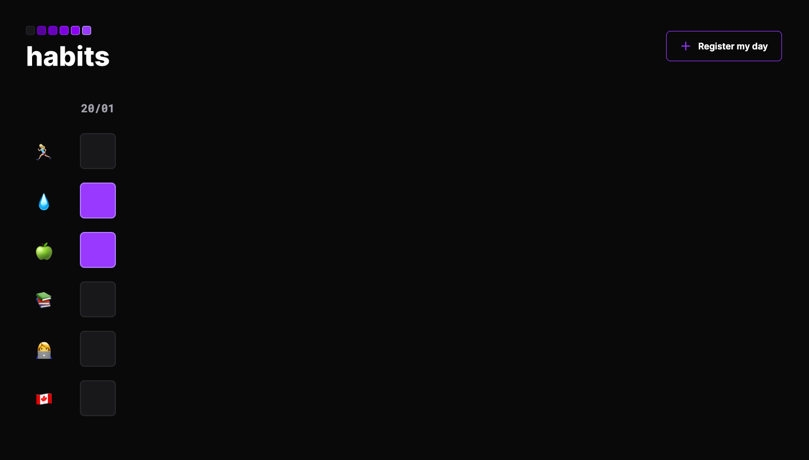

# habits web app [NLW-Setup] [Mission Explorer]

## The Project
An daily routine tracker

- [Project live online](https://raquelmichelon.github.io/habits-nlwSetup-mission-explorer/)

## Day 1 - Monday
- Concepts Review: HTML, CSS, MD 
- Use of https://www.fronteditor.dev/

## Day 2 - Tuesday
- CSS Especificity 

## Day 3 - Wednesday
- Using External Js library
- Reading Lib documentation (https://maykbrito.github.io/libs/NLWSetup/documentation/NLWSetup.html#setData)
- Js Review
- @media for button responsivity

## Day 4 - Thursday
- Event Listener
- JS Built in functions
- Local Storage

### ♡ Acknowledgment

♡ Thanks to Rocketseat [NLW #11 Setup] who has prepared all those content. 
