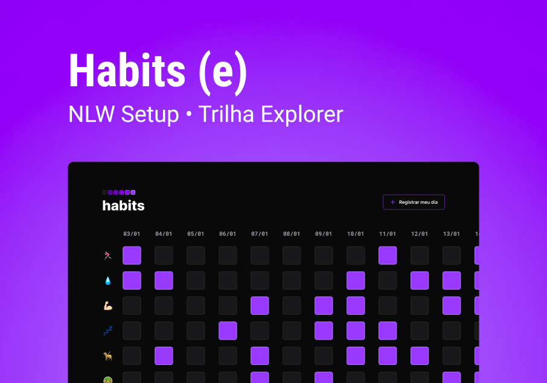

# habits web app [NLW-Setup] [Mission Explorer]

## The Project
An app to check daily routine

## Day 1 - Monday
- Concepts Review: HTML, CSS, MD 
- Use of https://www.fronteditor.dev/

## Day 2 - Tuesday
- CSS Especificity 

## Day 3 - Wednesday
- Using External Js library
- Reading Lib documentation (https://maykbrito.github.io/libs/NLWSetup/documentation/NLWSetup.html#setData)
- Js Review
- @media for button responsivity

### Acknowledgment

♡ RocketSeat [NLW #11 Setup] who has prepared all those content. 
